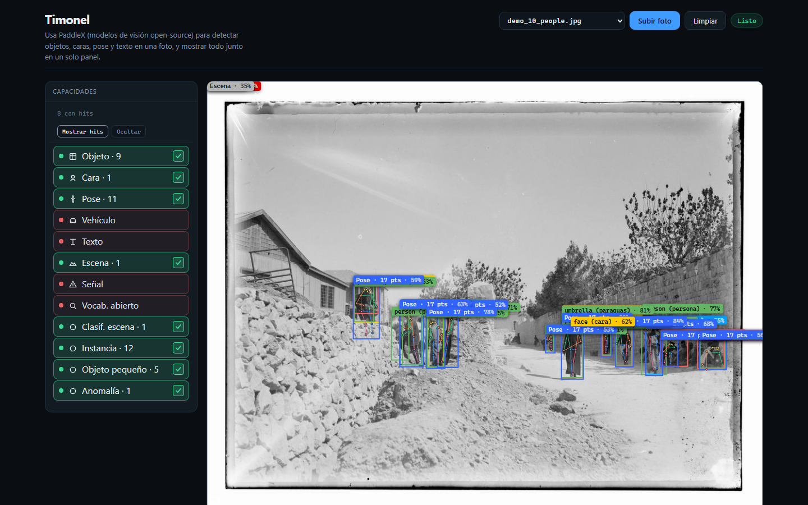

# Timonel

## English summary

Timonel orchestrates PaddleX detectors over **one photo** — objects, faces, and on-demand layers (pose, vehicles, text, …). You toggle each layer and see what it contributes. Stack: Docker Compose + FastAPI adapter/bridge + SPA. Try it with `docker compose up --build --wait`, then open http://localhost:8000/.

---

Timonel orquesta detectores PaddleX sobre **una foto**: objetos, caras y
capas bajo demanda (pose, vehículos, texto, …). Vos prendés cada capa y mirás
qué aporta.

> Orquestar, no inventar.



<p align="center"><sub>Varias capacidades PaddleX orquestadas sobre una sola foto: objetos, caras y pose unificados en un flujo de eventos.</sub></p>

## Prerrequisitos

- Docker Desktop / Engine + Compose v2
- ~8 GB RAM libres para el stack **core** (más para `--profile full`)
- Red la primera vez (descarga de imágenes/modelos; puede tardar varios minutos)

No hace falta Node ni Python en el host para la UI. El `.env` es **opcional**
(Compose ya trae defaults); copialo solo si querés ajustar flags.

## Probarlo (core)

```bash
docker compose up --build --wait
```

PowerShell equivalente: el mismo comando.

Abrí [http://localhost:8000/](http://localhost:8000/) (redirige a `/app/`).

1. En el selector elegí una `demo_*.jpg` **core** (p. ej. `demo_03_street.jpg`)
   o subí una foto.
2. Esperá overlays / eventos (objetos + caras).
3. Si hay capas en “Bajo demanda” disponibles, dale **Prender** — re-analiza
   la misma foto sin volver a subirla.

| | |
|--|--|
| UI | http://localhost:8000/ |
| Health | http://localhost:8000/health |
| Eventos | http://localhost:8000/events |

Smoke opcional (Python en el host):

```bash
python scripts/smoke_onboarding.py
# solo UI: python scripts/smoke_onboarding.py --ui-only
```

Progreso: `docker compose ps` · `docker compose logs -f bridge`

## Demos versionadas

En [`imagenes_muestra/`](imagenes_muestra/) hay `demo_*.jpg` con licencia
redistribuible (ver `LICENSE.md`). El manifiesto indica `requires: core|full`:

- **core** — andan con el default (objects + faces)
- **full** — texto/OCR y capas que piden `--profile full`

## Qué hace

1. El [adapter](adapter/) recibe la foto y sirve la UI.
2. El [bridge](bridge/) llama a las capacidades en [detection/](detection/).
3. Fusiona resultados y publica eventos tipados.
4. La UI dibuja overlays, leyenda y analítica.

```text
foto → adapter → bridge → PaddleX
                      ↓
              PerceptionEvent → UI
```

## Core vs full

Con `docker compose up` (CPU):

- `adapter` + `bridge` + **objects** + **faces**

El resto va a profile `full` + [`.env.full.example`](.env.full.example)
(más RAM/CPU, cold start más largo, puertos PaddleX `8080–8093`):

```powershell
Copy-Item .env.full.example .env
docker compose --profile full up --build --wait
```

```bash
cp .env.full.example .env
docker compose --profile full up --build --wait
```

Full agrega vehicles (tipo/color/patente), OCR, pose, peatones, escena,
open-vocab/signs, face-id, scene-cls, instances, small-objects, anomaly.

- **Face ID:** `FACE_ID_INDEX_KEY` vacío en el example — ver `detection/face_id/`.
- **open-vocab / signs:** comparten `:8093`; no pauses open-vocab solo.
- Apagado: `docker compose --profile full down` (añadí `-v` solo si querés
  borrar caches de modelos).

GPU (sustituye vehicles CPU):

```bash
docker compose -f docker-compose.yml -f compose.gpu.yml --profile full up --build
```

No levantes `--profile demo` junto al bridge real (dos bridges en `/events`).
Usá `docker compose up adapter bridge-demo` solo si querés el sintético.

| Síntoma | Qué mirar |
|---------|-----------|
| `unhealthy` | `docker compose ps` + `logs`; `start_period` 300s en PaddleX |
| `OOMKilled` | Subir `mem_limit` o bajar `BRIDGE_MAX_WIDTH` |
| Demo texto sin OCR | `ENABLE_SCENE_OCR=true` + profile full |

## Recursos

Cada contenedor PaddleX tiene techo ~2 GB RAM. Si hay OOM, subí `mem_limit`
o bajá `BRIDGE_MAX_WIDTH`.

## Desarrollo

```bash
PYTHONPATH=. python3 tests/test_timonel.py
PYTHONPATH=. python3 tests/test_bridge_helpers.py
PYTHONPATH=. python3 tests/test_compose_onboarding.py
```

Más: [tests/](tests/), [infra/](infra/), [adapter/ui/](adapter/ui/).

## Si algo falla

```bash
docker compose logs -f bridge
docker compose logs -f adapter
curl http://localhost:8000/media/current
```
